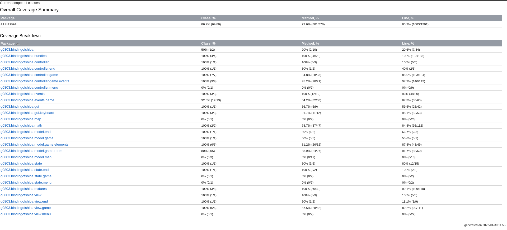

## LDTS_G0803 - Binding of Shiba

In this exciting dungeon crawler you can help Shiba make eveyone feel loved, by exploring the level and shooting hearts at enemies or, as Shiba likes to put it, possible new friends.

This project was developed by *André Lima* (up202008169@edu.fe.up.pt), *Guilherme Almeida* (up202006137@edu.fe.up.pt) and *Mariana Lobão*(up202004260@edu.fe.up.pt) for LDTS 2021/22.

### IMPLEMENTED FEATURES

- Although we don't have any features implemented yet, we are very close to get a structure we are satisfied with and that will enable us to quickly introduce new features.

### PLANNED FEATURES

- **The player can move**. By pressing W, A, S or D, the player can move across the map. 

    

- **You can explore different rooms**. Pick up keys and wander around different rooms.

    

 
  
- **Shoot hearts at enemies**. Shiba should be able to shoot heart-shaped projectiles against enemies by using the arrow keys.

    

 

- **See your health bar**. You will be able to see how much HP you have left.

    

 

- **Enemies flash when attacked**. To let you know when you hit an enemy, they will flash red.

    

 

- **Enemies can attack you in an aura**. They will first try to get close to you and then they will flash a damaging aura that hurts Shiba.

    

 

- **The player can use a menu to play or exit the game**. If they select play, the game will start. If they select exit, the game will exit. At any time, the player can press ESC to bring up the pause menu.

    

 

### DESIGN

#### General Structure

- **Problem in Context**. We needed a way to organize our code that would allow us to easily add new features and to easily test what we've added. Since this is also a GUI application, the MVC (Model-View-Controller) came to mind.

- **The Pattern**. The *Model-View-Controller pattern* is an **Architectural pattern** in which the code is split up into three parts: the model, the controller and the view. The model is responsible for storing the data, the controller is responsible for mutating the model and the view is responsible for rendering the model.

- **Implementation**. As we've said before, the MVC pattern has three major components: the model (for storing data), the controller (for mutating the model and controlling the logic of the game) and the view (for rendering the game to the screen).

    

    <strong>Fig 1.</strong> MVC Pattern

- **Consequences**. The use of this pattern allows for easier introduction of new features and enforces the Single Responsibility Principle. On the down side, this pattern creates a class for each model, which leads to a lot of dumb classes (classes that can't do anything on their own).

 

#### Interactions with Lanterna

- **Problem in Context**. Lanterna is an external dependency in which breaking changes can be introduced at any time. To take care of this, we need a way to isolate calls to Lanterna. Furthermore, we only need to access a very small part of Lanterna's API for our game. The *Facade pattern* immediately came to mind. This pattern allows us to choose what functionalities to expose and, if a breaking change gets introduced in Lanterna, we only need to update the methods in the facade instead of having to perform [shotgun surgery](https://refactoring.guru/smells/shotgun-surgery).

- **The Pattern**. The pattern is made up of an interface, which specifies the functionalities to implement, and an implementation of those functionalities, using another class' methods (in this case, Lanterna's Screen and InputProvider). By using the Facade design pattern, we ensure our code changes are minimal, in case an external method is updated. Furthermore, we can choose what functionalities to expose and considering Lanterna has hundreds of methods to use, this came as a natural choice.

- **Implementation**. We use the Facade pattern in two places: the GUI interface and the Keyboard interface. Their concrete implementations are LanternaGUI and LanternaKeyboard, respectively. LanternaGUI handles graphic operations such as clearing the draw buffer or refreshing it and LanternaKeyboard is responsible for keeping track of the key the user is pressing.

    

    <strong>Fig 2.</strong> Facade pattern

- **Consequences**. The use of the Facade design pattern allows for easier maintenance, and a lower amount of duplicated code. It also provides less cluttered code, where we only use the methods we need from Lanterna. On a final note, it opens the possibility that other GUI and Keyboard providers could be implemented and used with minimal changes to our code.

 

#### Application state

- **Problem in Context**. We need a way to know when the application is on the menu or when it is running the game. We could use if statements with a boolean variable, but it would make the code more dificult to update (if we wanted to add, for instance, a shop, we would have to add another if statement and change the boolean variable to an int). As such, the *State pattern* came to mind. It uses polymorphism to solve this problem, meaning each state (menu, game, ...) has its own class with its own logic. Because of this, the organization of the application becomes visible in the code and much more organized.

- **The Pattern**. The State pattern consists of a context (that contains the state) and a few states. Each state has access to the context and, as such, can change its state to another state.

- **Implementation**. In our Main class, we have our application state, which will be either a menu state or a game state (currently, it can only be a game state). When the user starts the game on the menu, the state of the application changes and the game starts. When the game ends, the state changes again and the window closes.

    

    <strong>Fig 3.</strong> State pattern

- **Consequences**. The State pattern allows us to use polymorphism to replace code that otherwise would have had a lot of if statements. Because of that, it makes the code clearer and makes the overall structure of the application easily visible.

 

#### Monster AI (Planned)

- **Problem in Context**. Monsters are medium-ranged attackers. As such, they first need to get close to the player and then attack it. The *Strategy pattern* comes to mind as the monsters will have two different strategies to choose from: the approach strategy and the attack strategy.

- **The Pattern**. The Strategy algorightm allows our monster controller to select a strategy to modify the model and to attack the player based on the environment it is on, by analizing its surroundings in every frame and, mainly, it's distance to the player.

- **Implementation**. TBD
  
- **Consequences**. This pattern will allow us to make the monster AI more complex more easily, if we choose to do so. Since every strategy is interchangeable, code changes will be minimal with this design pattern, when adding new strategies. Furthermore, the code is simplified since every behaviour gets split into its own class.

#### KNOWN CODE SMELLS AND REFACTORING SUGGESTIONS

#### Speculative Generality

Some of our classes, such as [Position](../src/main/java/g0803/bindingofshiba/model/game/Position.java), have methods that aren't used anywhere else (such as `Position#getNeighbors`). This was done because, initially, it was discussed that all elements would only move one place at a time, but, with recent discussions, that idea was thrown out and now the method is mostly useless.

A way to improve the code would be to remove said method.

### TESTING

- Screenshot of coverage report.

    

- Link to mutation testing report.
  - [Click here!](https://limwa.github.io/ldts-intermediate-delivery/index.html)

### SELF-EVALUATION

We have all given our best and feel like the work was equally distributed across all participants.

- André Lima: 33.3%
- Guilherme Almeida: 33.3%
- Mariana Lobão: 33.3%